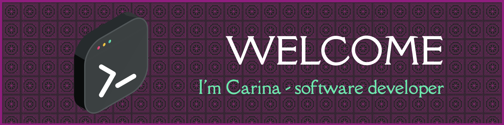

## 🖖🙂 Hi
I'm a software engineering student @[42Berlin](https://42berlin.de) since December 2022 and only 2 projects away to complete and to be ready to dive into the professional world. 
<html>

	<table>
		<tr>
			<td><code></code></td>
			<td><code></code></td>
			<td><code></code></td>
			<td><code></code></td>
			<td><code></code></td>
			<td><code></code></td>
		</tr>
	</table>

</html>

- 👩‍💻 I’m currently working on [Inception](https://youtu.be/mgSc_NhVQU8?si=Q5u53DWYqFlyxCXz)
- 👯 I’m looking to collaborate in creative open source projects
- 📫 How to reach me: [Linkedin](https://www.linkedin.com/in/carinaestevezorth)
- 👽 Pronouns: she/her
<!--
**cariestevez/cariestevez** is a ✨ _special_ ✨ repository because its `README.md` (this file) appears on your GitHub profile.

Here are some ideas to get you started:

- 🔭 I’m currently working on my 42 projects
- 🌱 I’m currently learning coding in C and C++, bash programming, containerization with Docker
- 👯 I’m looking to collaborate on open source projects and medical related topics
- 💬 Ask me about 
- 📫 How to reach me: [Linkedin](https://www.linkedin.com/in/carinaestevezorth)
- 😄 Pronouns: svangheri/wholesome
-->
